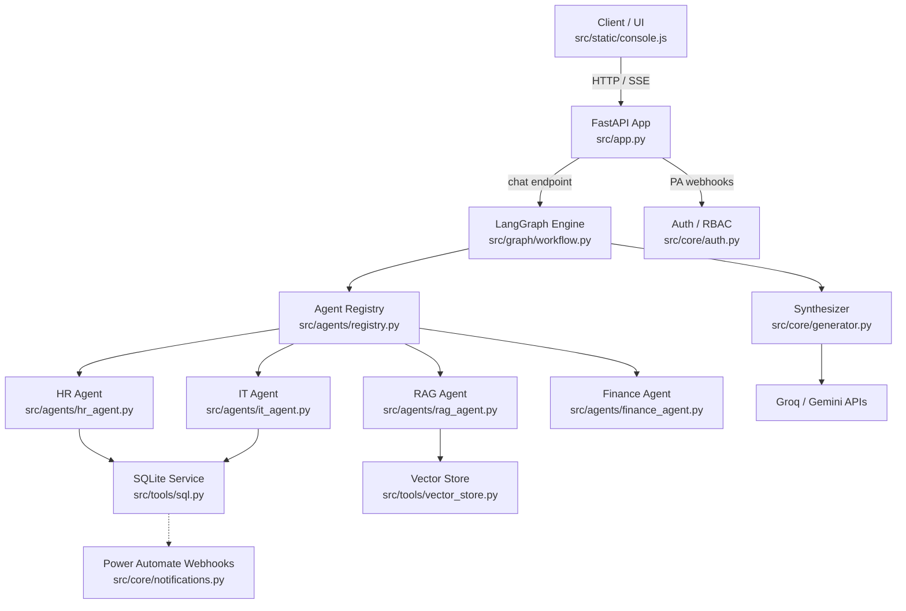
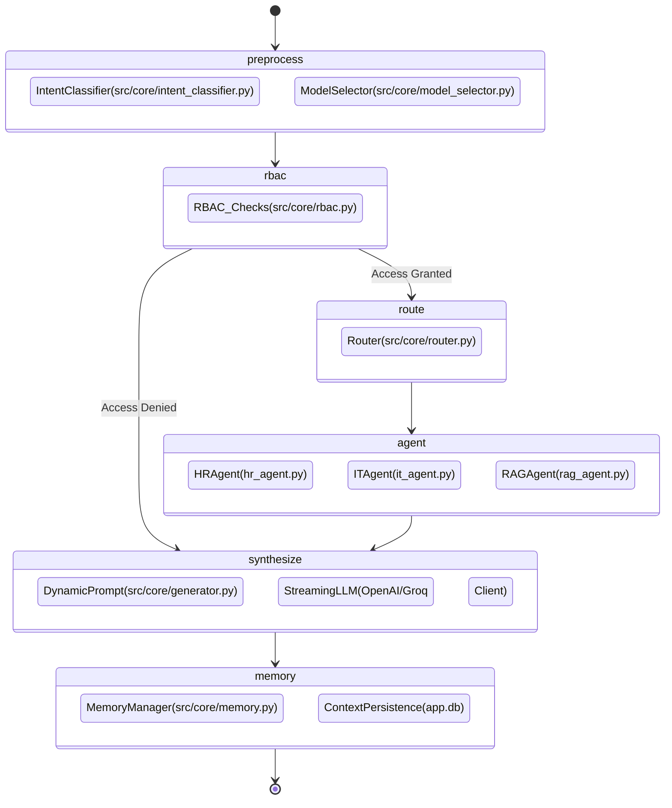
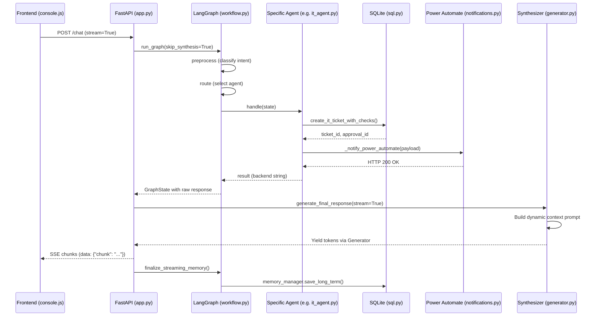
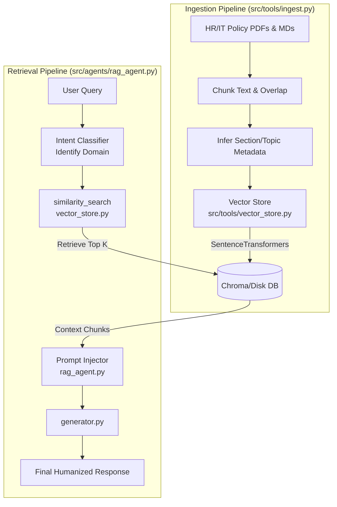
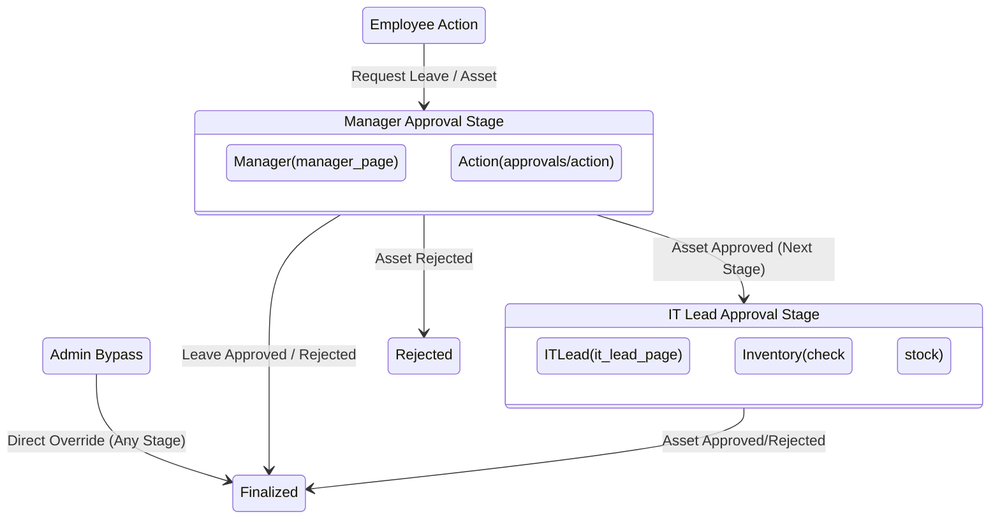
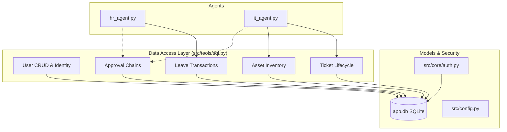
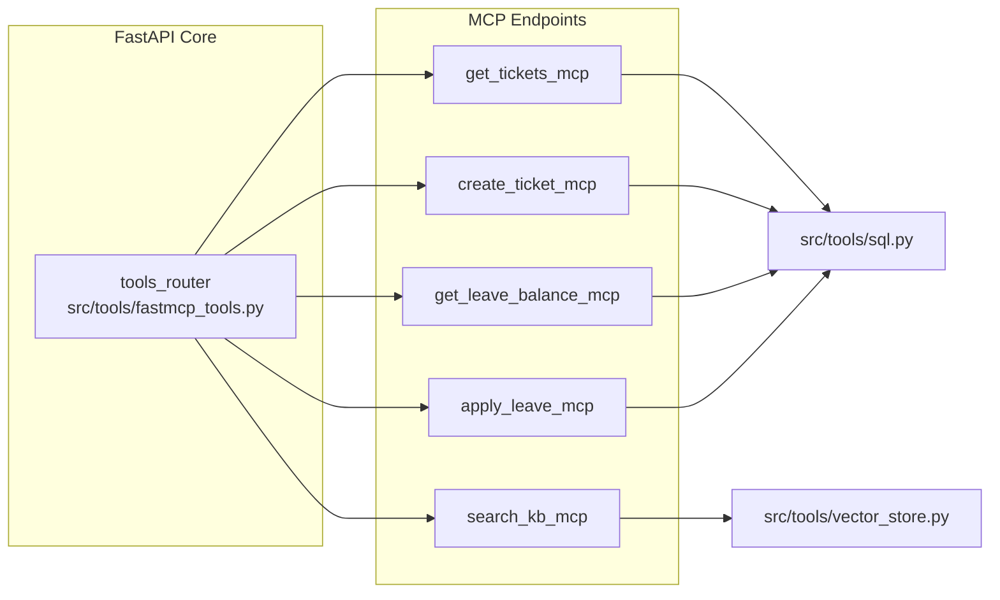

# SWARM Enterprise AI System: Technical Architecture

This document contains 7 comprehensive Mermaid diagrams illustrating the deepest technical mechanics of the SWARM repository, followed by an exhaustive repository file walkthrough.

## 1. High-Level System Architecture
This diagram outlines the macro-level services, the core API interface, and the division between the LangGraph execution engine, agent registries, and external persistence layers.

## 2. LangGraph Orchestration Flow
This details the actual `GraphState` execution pipeline defined in `src/graph/workflow.py`. It shows the precise node sequence from intent classification down to final context persistence.

## 3. Complete Request Execution Flow (Streaming Enabled)
An end-to-end sequence diagram demonstrating how an HTTP request invokes the graph asynchronously, retrieves backend state, and streams Server-Sent Events (SSE) back to the user via `generator.py`.

## 4. RAG Pipeline Flow
Visualizes the parallel pipelines for ingestion (run via background thread on startup) and retrieval (executed by the RAG agent).

## 5. RBAC + Approval Workflow Diagram
Shows the hierarchical gatekeeping matrix implemented via `src/core/rbac.py` and the `sql.py` cascading approval engine.

## 6. Database + Service Interaction Diagram
Maps out the tight coupling between core service logic (`auth.py`, `sql.py`) and the underlying SQLite `app.db` relational schema.

## 7. Tool + FastMCP Interaction Diagram
Illustrates the exposed tool architecture (via `fastmcp_tools.py`) enabling external services or external AI models to interact securely with the SWARM API via Model Context Protocol interfaces.

---

## Complete Repository Walkthrough & Architecture Explanation

### 1. The Core Infrastructure (`src/` and Root)
The repository uses a monolithic Python backend structured for a heavily decoupled agentic framework. 
* **`src/app.py`**: The central nervous system. It mounts the FastAPI application, serves the static HTML/CSS/JS files, and houses all explicit HTTP endpoints (`/chat`, `/auth/login`, `/tickets/my`, etc.). It natively supports **SSE (Server-Sent Events)** streaming.
* **`src/config.py`**: A centralized Pydantic settings module that dynamically maps API keys (`GROQ_API_KEY`) and endpoints from the root `.env` file.
* **`data/` & `app.db`**: SQLite database housing relational tables for users, roles, leaves, tickets, assets, approvals, and audit logs.
* **`src/static/`**: Vanilla JavaScript (`console.js`, `signup.js`), standard HTML (`console.html`, `index.html`), and pure CSS (`styles.css`). This was designed to be hyper-fast and entirely devoid of heavy frontend frameworks.

### 2. State & Memory Management (`src/core/`)
* **`memory.py`**: Manages short-term conversation context (`Session State`) and long-term history. It is highly pivotal because the LangGraph DAG resets state per turn; this module acts as the persistent brain.
* **`intent_classifier.py`**: An LLM-based router. Before any agent acts, this file hits the Groq API to extract JSON identifying: `is_question` (bool), `domain` (IT, HR, Finance, General), and `intent_type` (action, status, policy, casual).
* **`generator.py`**: The synthesis engine. This intercepts raw "robotic" responses from backend queries (like "Ticket 32 Assigned") and processes them into natural, empathetic, conversational AI responses.
* **`rbac.py`**: Role-Based Access Control matrix. This module halts execution if an `employee` requests to query `it_lead` data.

### 3. The LangGraph Engine (`src/graph/workflow.py`)
This is the execution topology. Instead of hardcoded `if/else` ladders, the system invokes `run_graph()`.
1. **`_preprocess`**: Invokes the intent classifier.
2. **`_rbac`**: Stops unauthorized requests.
3. **`_route`**: Pushes the context to `registry.py` to retrieve the correct Agent class.
4. **`_agent`**: Executes the deterministic Python logic.
5. *(Optional)* **`_synthesize`**: Bypassed if Streaming is active, otherwise invokes `generator.py` inline.
6. **`_memory`**: Saves entities (like mentioned Ticket IDs) back into memory.

### 4. The Agent Swarm (`src/agents/`)
Agents strictly inherit from `AgentBase` and define `handle(state)`.
* **`hr_agent.py` & `it_agent.py`**: They parse temporal data (e.g., "next Tuesday") using `date_parser.py`, and invoke strict SQL transactions via `src/tools/sql.py`.
* **`rag_agent.py`**: The fallback knowledge agent. It uses `vector_store.py` to semantically search embeddings for policy-related questions not covered by SQL transactions.

### 5. Tools & Persistence (`src/tools/`)
* **`sql.py`**: The single source of truth for transactions. All database calls (CRUD for users, tickets, approvals) live here. It manages the complex tiered approval chains (Manager -> IT Lead).
* **`ingest.py`**: Uses `pypdf` and text chunking to break down policy documents stored in `data/docs/`. It runs on a background daemon thread on startup (inside `app.py`) to prevent server blocking.
* **`fastmcp_tools.py`**: An adapter layer that exposes standard tool functions via the **Model Context Protocol**, making SWARM capabilities accessible to external automation tools.
